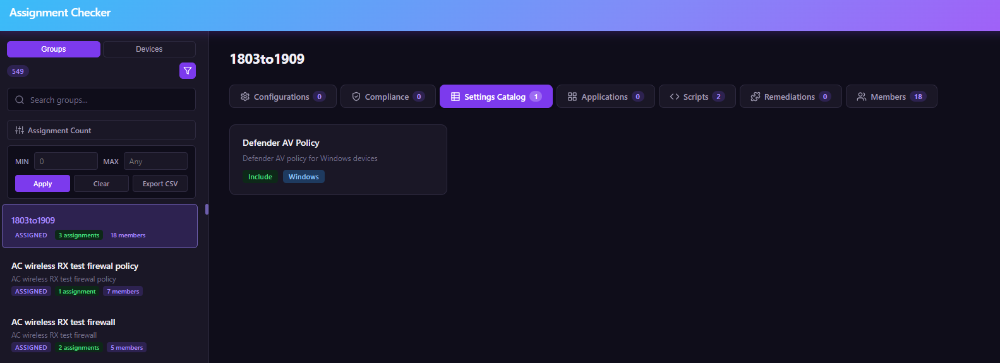
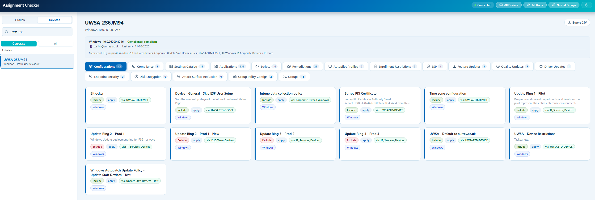

# Assignment Checker

## Features

- Browse all Entra ID groups in a searchable sidebar — each group shows a **Dynamic** or **Assigned** badge so you can quickly identify its membership type
- Filter to show only groups that have Intune assignments
- **Assignment count per group** — each group displays the total number of directly-targeted assignments (excludes All Devices/All Users)
- **Assignment count range filter** — narrow down the group list by assignment count (e.g. show only groups with 1–10 assignments)  

- View Intune assignments per group across five categories:
  - **Device Configurations** — Configuration profiles
  - **Compliance** - Compliance profiles
  - **Settings Catalog** — Settings Catalog policies
  - **Applications** — Assigned apps (required, available, uninstall)
  - **Scripts** — Platform scripts. Click the 👁 eye icon on any script card to view its full contents in a preview panel.
  - **Remediations** — Proactive remediation (health) scripts
- See assignment type (Include / Exclude / All Users / All Devices), intent, and filter information at a glance with colour-coded badges

- **Nested group assignments** — when a group is nested inside another group, inherited assignments from parent groups are automatically discovered and shown with an "Inherited: Parent Group Name" badge, so you can see exactly where each assignment originates. A **Nested Groups** toggle in the header lets you show or hide inherited assignments.

- **All Devices & All Users groups** — dedicated entries at the bottom of the group list let you see every policy, app, script, and remediation assigned to All Devices or All Users across all categories in one click
- **Show/Hide All Devices & All Users** — global toggle buttons in the header to show or hide those assignments across all groups, reducing clutter in large tenants
- **Dynamic membership rule display** — when selecting a dynamic group, the membership rule query is shown below the group name for quick reference
- **Copy to clipboard** — hover-to-reveal copy buttons on group names, descriptions, dynamic membership rules, and assignment card names for fast copy/paste

- **Orphaned items detection** — a dedicated **Orphaned Items** view lists all Intune items (configurations, settings catalog policies, applications, scripts, and remediations) that have zero assignments, making it easy to identify stale items for cleanup. Includes a **CSV export** for quick reporting.

- **Export to CSV** — download all assignments for the selected group as a CSV file for offline review or reporting
- Direct deep links to policies and apps in the Intune portal
- **Reliable data loading** — the app handles temporary Microsoft Graph issues automatically and still shows results even if one category encounters an error
- Dark mode with system preference detection
- Responsive design for desktop, tablet, and mobile

## Group Assignments Example


## Device Assignments Example


## How to Run

### PowerShell Backend (Local)

Run the PowerShell script locally. 

**Prerequisites:**

- **PowerShell 5.1+** or **PowerShell 7+** (preferred)
- An Entra ID account with sufficient privileges to read Intune configuration and group data

> The script installs the `Microsoft.Graph.Authentication` module automatically if it is not already present.

**Quick Start:**

```powershell

# Run the script
.\AssignmentChecker.ps1
```

The script will:

1. Install the `Microsoft.Graph.Authentication` module (first run only).
2. Connect to Microsoft Graph via the **Microsoft Graph Command Line Tools** app — no app registration needed.
3. Open a browser window for sign-in. On first use, you may be prompted to consent to the required permissions.
4. Start a local web server on **http://localhost:8080** and open it in your default browser.

**Custom Port:**

```powershell
.\AssignmentChecker.ps1 -Port 9090
```

## Permissions

Both modes require the same Microsoft Graph **delegated** permissions:

| Permission | Type | Description | Admin Consent Required |
|---|---|---|---|
| `DeviceManagementApps.Read.All` | Delegated | Read Microsoft Intune apps | Yes |
| `DeviceManagementConfiguration.Read.All` | Delegated | Read Microsoft Intune Device Configuration | Yes |
| `DeviceManagementManagedDevices.Read.All` | Delegated | Read Microsoft Intune devices | Yes |
| `DeviceManagementScripts.Read.All` | Delegated | Read Microsoft Intune Scripts | Yes |
| `Group.Read.All` | Delegated | Read all groups | Yes |
| `User.Read` | Delegated | Sign in and read user profile | No |
| `User.Read.All` | Delegated | Read all users' full profiles | Yes |

All permissions are **read-only**. The app cannot modify your Intune environment.

## Security Notes

- **Read-only** — the app only requests read permissions and cannot make any changes to your Intune environment
- **No secrets stored** — in PowerShell mode, no credentials are saved anywhere; in SPA mode, only your Client ID and Tenant ID are remembered in your browser (these are not secrets)
- Treat all Intune and Entra data as sensitive — avoid using the app on shared or public computers
- Press **Ctrl+C** to stop the PowerShell server; it disconnects from Microsoft Graph automatically