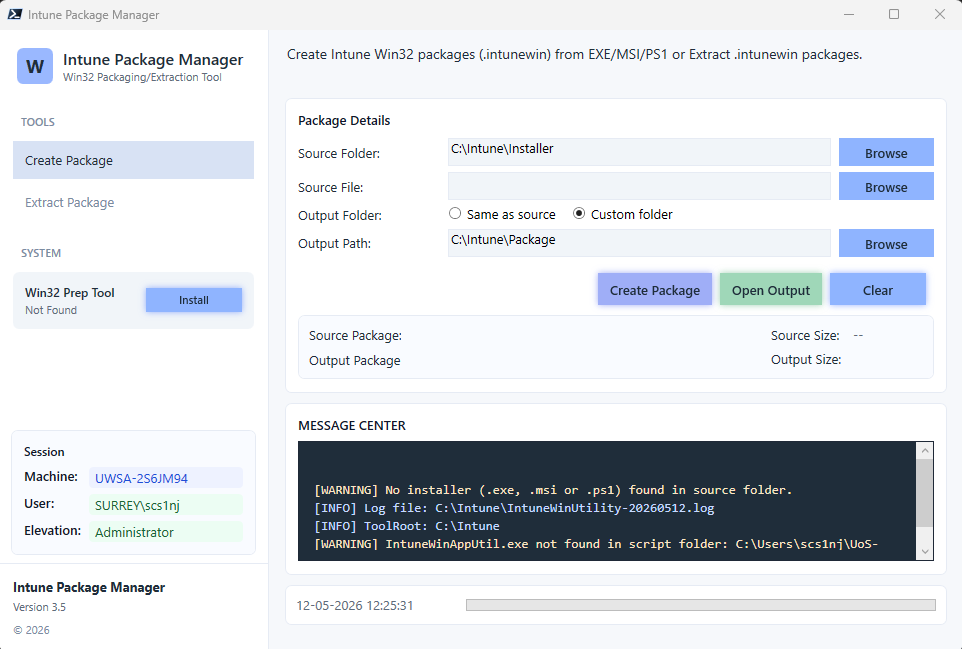
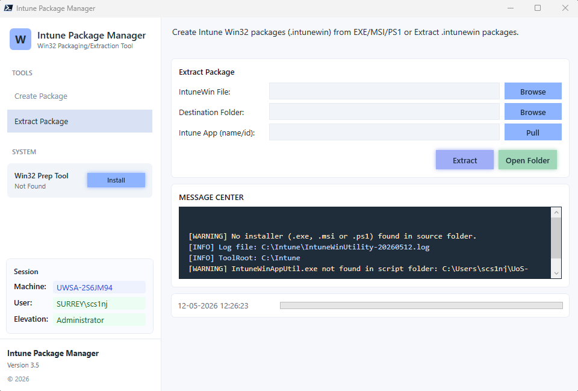

# Intune Package Manager

Intune Package Manager is a Windows PowerShell GUI tool for Intune Win32 app packaging and retrieval workflows.

## What it does

- Create .intunewin packages from installer source folders.
- Extract standard .intunewin packages.
- Pull Win32 content from Intune using Graph API and feed into extraction.
- Pull Win32 content using device MDM certificate flow (SideCar), then download and decrypt automatically.
- Extract already-decoded ZIP payloads as well as standard IntuneWin wrappers.

## Requirements

- Windows with Windows PowerShell 5.1.
- IntuneWinAppUtil.exe available:
	- In the same folder as IntunePackageManager.ps1, or
	- Installed/updated from the tool using the Check/Update button.
- For Graph pull:
	- Microsoft Graph PowerShell authentication module.
	- Active Graph session before using Graph pull.
- For Device Cert pull:
	- Intune-enrolled device with valid MDM device certificate.
	- Intune Management Extension present.
	- Valid local device-context token in TokenBroker cache.

## Quick start

1. Run IntunePackageManager.ps1 in Windows PowerShell.
2. For package creation:
	 - Set source folder.
	 - Confirm setup file.
	 - Choose output folder.
	 - Click Run.

3. For extraction:
	 - Open the Extract view.
	 - Select package file (or use pull buttons).
	 - Choose destination folder.
	 - Click Extract.

## Pull modes

Please note that to use the below make sure you connect to graph first.

### Graph

- Uses Graph Win32 content endpoints to download app package files.
- Best when you already have a valid Graph login session.

### Pull (Device MDM Cert)

- Uses the device MDM certificate and SideCar gateway requests.
- Performs app lookup, content info request, file download, and decryption.
- Produces a decoded ZIP that can be extracted directly by the tool.

## Default working locations

- Source default: C:\Intune\Installer
- Output default: C:\Intune\Package
- Logs: C:\Intune\IntunePackageManager-YYYYMMDD.log

## Notes

- The Message Center in the GUI shows progress and errors by level.
- If Graph pull fails due to authentication, connect first and retry.
- If Device Cert pull fails, confirm enrollment, certificate availability, and IME health.
