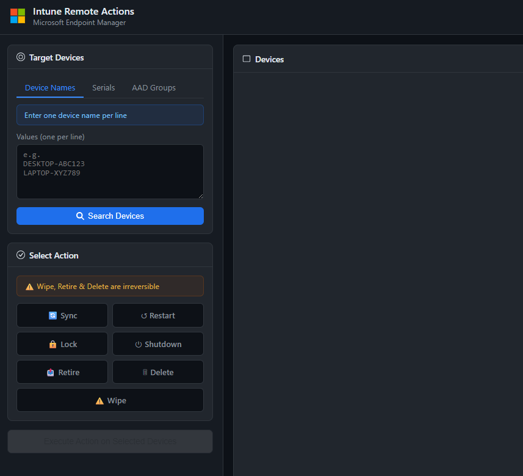
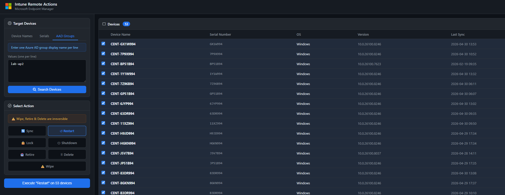

# Intune Remote Actions

A self-contained PowerShell script that launches a browser-based GUI for performing remote management actions on Intune-enrolled devices via Microsoft Graph.



## AAD Group Remote Action

---

## Features

- **Web-based interface** — runs a local HTTP server and opens your default browser automatically
- **Three search modes** — find devices by Device Name, Serial Number, or Azure AD Group
- **Seven remote actions**:
  | Action | Risk Level | Notes |
  |--------|-----------|-------|
  | Sync | Safe | Forces an Intune policy sync |
  | Restart | Safe | Remotely restarts the device |
  | Lock | Warning | Android, iOS, and macOS only |
  | Shutdown | Warning | Remotely powers off the device |
  | Retire | Warning | Removes company data, keeps personal data |
  | Delete | Danger | Removes the device record from Intune |
  | Wipe | Danger | **Full factory reset — irreversible** |
- **Confirmation modal** — lists all targeted devices before any action is executed
- **Action log** — timestamped results for every operation
- **Multi-device support** — select/deselect individual devices from search results before acting

---

## Requirements

- PowerShell 5.1 (Preferrably PowerShell 7+ (pwsh))
- [Microsoft Graph PowerShell SDK](https://learn.microsoft.com/en-us/powershell/microsoftgraph/installation)

```powershell
Install-Module Microsoft.Graph -Scope CurrentUser
```

- The following Graph API permissions (granted interactively on first connect):
  - `DeviceManagementManagedDevices.ReadWrite.All`
  - `Group.Read.All`
  - `GroupMember.Read.All`

---

## Usage

Connect to Graph using secret before running this script

```powershell
.\IntuneRemoteActionsGUI.ps1
```

The script will:
1. Start a local web server on `http://localhost:8765`
2. Open your default browser to the interface automatically
3. Prompt you to sign in to Microsoft Graph via the **Connect to Graph** button

To stop the server press **Ctrl+C** in the PowerShell window.

---

## Workflow

1. Click **Connect to Graph** and authenticate with your Microsoft 365 account
2. Choose a search mode tab: **Device Names**, **Serials**, or **AAD Groups**
3. Enter one value per line and click **Search Devices**
4. Select the devices you want to act on (all are pre-selected by default)
5. Click an action tile (Sync, Restart, Lock, etc.)
6. Click **Execute** — review the confirmation modal and confirm

---

## Notes

- Wipe, Retire, and Delete are **irreversible**. The UI highlights these in red and requires explicit confirmation.
- Lock is only supported on Android, iOS, and macOS devices.
- The script does not store any credentials — authentication is handled entirely by the Microsoft Graph SDK via interactive browser sign-in.
- Port `8765` must be free. If it is in use, run the script as Administrator or terminate the conflicting process.

---

## References

- [Microsoft Graph — Managed Device resource](https://learn.microsoft.com/en-us/graph/api/resources/intune-devices-manageddevice?view=graph-rest-1.0)
- [Intune remote actions documentation](https://learn.microsoft.com/en-us/mem/intune/remote-actions/device-management)
- [Microsoft Graph PowerShell SDK](https://learn.microsoft.com/en-us/powershell/microsoftgraph/overview)
